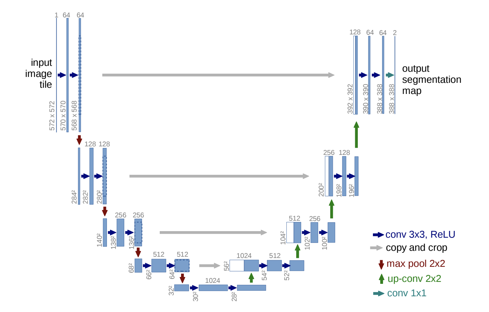
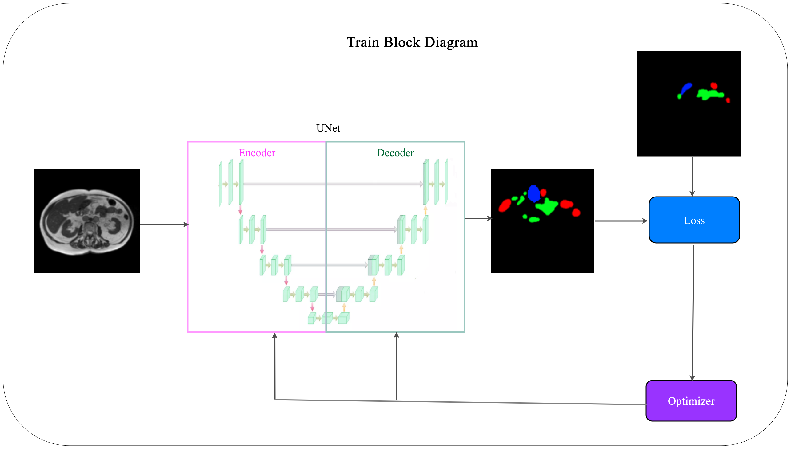

  

<h1 align="center">Medical Image Segmentation</h1>

## 1. Problem Statement

 Medical Image Segmentation is a computer vision task that involves dividing a medical image into multiple segments. In this context, the task is the segmentation of healthy organs in medical scans, particularly in the gastrointestinal (GI) tract, to enhance cancer treatment. For patients eligible for radiation therapy, oncologists aim to deliver high doses of radiation using X-ray beams targeted at tumors while avoiding the stomach and intestines. The goal is to effectively segment the stomach and intestines in MRI scans to improve cancer treatment, eliminating the need for the time-consuming and labor-intensive process in which radiation oncologists must manually outline the position of the stomach and intestines, addressing the challenge of daily variations in the tumor and intestines' positions. 

 
  

    
  

 

As shown in the figure, the tumor (pink thick line) is close to the stomach (red thick line). High doses of radiation are directed at the tumor while avoiding the stomach. The dose levels are represented by a range of outlines, with higher doses shown in red and lower doses in green.

 The main challenge is to provide better assistance to patients. The issue lies in the tumor size, which often results in radiation X-rays inadvertently coming into contact with healthy organs. The segmentations must be as precise as possible to prevent any unintended harm to the patient. The problem is to develop a deep learning solution that automates the segmentation of the stomach and intestines in MRI scans of cancer patients who undergo 1-5 MRI scans on separate days during their radiation treatment. 

## 2. Related Works
| Date | Title                                                                                                               | Code                                                                                                                     | Link                                                         |
|------|---------------------------------------------------------------------------------------------------------------------|--------------------------------------------------------------------------------------------------------------------------|--------------------------------------------------------------|
| 2015 | U-Net: Convolutional Networks for Biomedical Image Segmentation                                                     | [Code](https://github.com/milesial/Pytorch-UNet) [Code](https://pytorch.org/hub/mateuszbuda_brain-segmentation-pytorch_unet/) | [Link](https://arxiv.org/pdf/1505.04597v1.pdf)               |
| 2015 | SegNet: A Deep Convolutional Encoder-Decoder Architecture for Image Segmentation                                    |                                                                                                                          | [Link](https://arxiv.org/pdf/1511.00561v3.pdf)               |
| 2016 | V-Net: Fully Convolutional Neural Networks for Volumetric Medical Image Segmentation                                | [Code](https://github.com/mattmacy/vnet.pytorch)                                                                         | [Link](https://arxiv.org/pdf/1606.04797v1.pdf)               |
| 2018 | UNet++: A Nested U-Net Architecture for Medical Image Segmentation                                                  | [Code](https://github.com/MrGiovanni/UNetPlusPlus)                                                                       | [Link](https://arxiv.org/pdf/1807.10165v1.pdf)               |
| 2019 | CE-Net: Context Encoder Network for 2D Medical Image Segmentation                                                   | [Code](https://github.com/Guzaiwang/CE-Net)                                                                              | [Link](https://arxiv.org/pdf/1903.02740.pdf)                 |
| 2022 | Medical Image Segmentation using LeViT-UNet++: A Case Study on GI Tract Data                                        | None                                                                                                                     | [Link](https://arxiv.org/pdf/2209.07515v1.pdf)               |
| 2023 | 3D TransUNet: Advancing Medical Image Segmentation through Vision Transformers                                      | [Code](https://github.com/Beckschen/3D-TransUNet)                                                                        | [Link](https://arxiv.org/pdf/2310.07781.pdf)                 |
| 2023 | DA-TransUNet: Integrating Spatial and Channel Dual Attention  with Transformer U-Net for Medical Image Segmentation | [Code](https://github.com/sun-1024/da-transunet)                                                                         | [Link](https://arxiv.org/pdf/2310.12570v1.pdf)               |
| 2023 | GI Tract Image Segmentation with U-Net and Mask R-CNN                                                               | None                                                                                                                     | [Link](http://cs231n.stanford.edu/reports/2022/pdfs/164.pdf) |

## 3. The Proposed Method

 U-Net is a popular and effective architecture for medical image segmentation tasks, including segmenting different parts of the gastrointestinal tract. It is known for its ability to produce accurate segmentations, especially when dealing with limited training data. The architecture of U-Net gives the model the ability of precise localization, meaning the model output a class label for each pixel, and therefore achieve image segmentation. 
 
  

      
    </a>
  

 

Figure shows network artitecture in the [original paper](https://arxiv.org/pdf/1505.04597v1.pdf). It consists of the repeated application of two 3x3 convolutions (unpadded convolutions), each followed by a rectified linear unit (RELU) and a 2x2 max pooling operation with stride 2 for downsampling. At each downsampling step we double the number of feature channels. Every step in the expansive path consists of an upsampling of the feature map followed by a 2x2 convolution (“up-convolution”) that halves the number of feature channels, a concatenation with the correspondingly cropped feature map from the contracting path, and two 3x3 convolutions, each followed by a ReLU. The cropping is necessary due to the loss of border pixels in every convolution. At the final layer a 1x1 convolution is used to map each 64-component feature vector to the desired number of classes. In total the network has 23 convolutional layers.

 
  

      
    </a>
  

 

 For this project, As shown in the figure, the model takes MRI scans from cancer patients as input images, then uses the U-Net method to obtain predicted segmented areas of patients' MRI scans for "stomach", "large bowel", and "small bowel". By employing the Dice loss function, it compares the predicted binary mask to the true binary mask, which we aim to minimize.

The [evaluation](https://www.kaggle.com/competitions/uw-madison-gi-tract-image-segmentation/overview/evaluation) metrics include the Dice coefficient and the 3D Hausdorff distance. 

## 4. Implementation
This section delves into the practical aspects of the project's implementation.

### 4.1. Dataset
Under this subsection, you'll find information about the dataset used for the medical image segmentation task. It includes details about the dataset source, size, composition, preprocessing, and loading applied to it.
[Dataset](https://drive.google.com/file/d/1-2ggesSU3agSBKpH-9siKyyCYfbo3Ixm/view?usp=sharing)

### 4.2. Model
In this subsection, the architecture and specifics of the deep learning model employed for the segmentation task are presented. It describes the model's layers, components, libraries, and any modifications made to it.

### 4.3. Configurations
This part outlines the configuration settings used for training and evaluation. It includes information on hyperparameters, optimization algorithms, loss function, metric, and any other settings that are crucial to the model's performance.

### 4.4. Train
Here, you'll find instructions and code related to the training of the segmentation model. This section covers the process of training the model on the provided dataset.

### 4.5. Evaluate
In the evaluation section, the methods and metrics used to assess the model's performance are detailed. It explains how the model's segmentation results are quantified and provides insights into the model's effectiveness.

